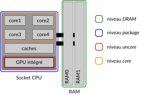

**C-states** provide the ability to request that the CPU enters a low-power state by turning off some pieces of logic or even cores. 

# Packages in a CPU

First, it is important to understand what are the pieces of a CPU. We can split the whole CPU (as we name it usually) into 4 differents levels : 

1. *core* level
2. *uncore* level
3. *package* level
4. *dram* level

The levels can be illustrated in here :

## *Core* level

First, the *core* refers to only the cores, as they might be multiples. It excludes the GPU integrated unit (if concerned) but also all **shared caches*. Nowadays, we have CPUs with at leats 4 cores so in general, L1 cache is exclusive to a core but L2 and L3 are shared. 

Thus, the *core* level is composed of a core, and its exclusive memory cache.

## *Uncore* level

The *Uncore* level refers to the integrated GPU. In many (expecially labtop one) CPUs, an integrated Graphic Processing Unit is included for rendering graphics. 

So this level can be empty if the CPU is only made of CPU cores.

## *Package* level

The *package* level refers to all *core* levels, the integrated GPU and all caches. It only excludes the DRAM.

## *DRAM* level

This level is refering to only the *Dynamic Random Access Memory*. We will probably not use this very much. 

# Threads VS Core VS Package C-States

**C-States** can therefore be seen at 3 differents levels :

1. Threads C-States
2. Core C-States
3. Package C-States

In a general way, a package is made of multiple cores all made of multiple threads. More details below. 

## TC-States

First, software request C-States on a thread level. 

Threads exists not on a physical level, only a *logical* one. Therefore, a **Thread C-State** or `TCx` is not a *true* and complete C-State. In facts, minimal if any power actions are taking when a thread enters a C-State level without being in a Core C-State level. 

> [!TIP]
> On CPUs without multithreading, thread and core C-State are exactly the same. 

## Core C-States

**Core C-State** or `Cx` or `CCx` represents if the core is on or off. When executing instructions, a core is always into `C0` state. When it does not, it enters various `Cx` states. If all threads on a core are in a `TC` state, then the full core enters a core C-State. 

`CCx` are defined by the constructor and can therefore be slightly distinct from one model to another. But generally we have the following states. 

| Core C-State | Wake Latency | Description |
|---|---|---|
| CC0 | Na | The active state (code executing): At least one thread is actively executing in this state. Autonomous clock gating is common for unused logic blocks. |
| CC1 |  ~1µs | Core clock gated: In CC1, the core clocks are (mostly) gated. Some clocks may still be active (for example, to service external snoops), but dynamic power is driven close to zero. Core caches and TLBs are maintained, coherent, and available. |
| CC1e | ~1µs + transition  | Core C1 + lowest frequency and voltage operating point |
| CC3 | ~50-100µs | Clocks gated and request for retention voltage: Processor state is maintained, but voltage is allowed to drop to Vret. L1 + L2 (core) caches are flushed. Core TLBs are flushed. |
| CC6 | ~ 50-100 µs | Power gating: The core is power gated (voltage at 0). L1 + L2 (core) caches are flushed. Core TLBs are flushed. Processor state is saved outside the core (and restored on a wake). |
| CC7-CC10 | various | CC6 with extra savings outside the core: Additional states deeper than CC6 exist on certain CPUs. These states are generally not supported on server processors today due to their long latencies. |

> [!NOTE]
> As we can see, deeper `CCx` induces longer wake up latency, and this is why states need to be entered carefully. The lantencies in this table are from a specific article and might vary from one model to another.  

## Package C-States

A package C-State or `PCx` request is determined by the value of the lowest `CCx` among all cores. It means that i requires that all core are at least in `CCx` with $ x > 1 $ .

> [!NOTE]
> `PCx` are slighly more complex than the other, and we need to check if they are relevant for us before investigating more into them

# Requesting and entering C-States

The software (ie programs or OS) can ony request C-State at the thread level. It means that until all threads of the same CPU core are on the same level, the core cannot enter a `CCx` deeper than `CC0`. 

When all threads on a core are on the same level, the CPU resolves the C-State level. It is **not** decided by the OS. The OS can only request states at the thread level, but the decision belongs to the CPU itself. 

In order to request C-States, there are 2 differents ways : 

- `MWAIT` : this is a hint function, and it can pass a precise substate to suggest the CPU which state would be better
- `P_LVLx` *[legacy]* : legacy method of I/O reads from the ACPI-defined processor clock control registers

> [!TIP]
> The support of `MWAIT` instructions can be tested trough the `cpuid` instruction, with `CPUID.01H:ECX.MONITOR[bit 3]`. See [our repo about `cpuid`](https://github.com/cpu-linky/cpuid) for easy interraction

# Ressources

- [official Intel documentation of CPU power in 12th generation model](https://edc.intel.com/content/www/us/en/design/ipla/software-development-platforms/client/platforms/alder-lake-desktop/12th-generation-intel-core-processors-datasheet-volume-1-of-2/011/power-management/)
- [CPU Power Management book](https://link.springer.com/chapter/10.1007/978-1-4302-6638-9_2#Sec25)
- [Minimum tutorial of cpu power management](https://metebalci.com/blog/a-minimum-complete-tutorial-of-cpu-power-management-c-states-and-p-states/)