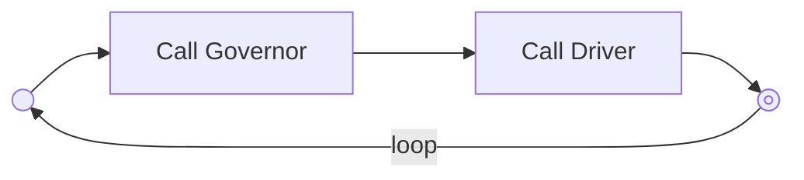

This page aims to explain and present all tools which are used by Linux to interract with the CPU. It will not deal with tools used by the user to control the performance states. 

# P-States

# `CPUFreq` for fixing dynamic freqencies

`CPUFreq` was implemented into the **Linux Kernel** and is the tool used by Linux to control the frequencies of the cores. It is really interesting because it allows to fix dynamix values for the frequencies, not only pre fixed values. 

There are **6** `CPUFreq` governors in Linux :

1. Performance
2. Powersave
3. Userspace
4. Ondemand
5. Conservative
6. Shedutil

The actual governor from a core can be displayed with the following command :

```sh
# works at least on Fedora 23,24 and Ubuntu 24.04
cat /sys/devices/system/cpu/cpuX/cpufreq/scaling_governor
```

where `X` is the core of the CPU, or `*` if you want to see them all. 

> [!NOTE]
> It is not sure if all governors are available every time or for each Linux version. There is a file called `/sys/devices/system/cpu/cpu*/cpufreq/scaling_available_governors`, containing only `performance` and `powersaver` in **Ubuntu 24.04**, so maybe all governors are not implemented.

> [!NOTE]
> `CPUFreq` is also used in addition with the official drivers from AMD or Intel. My labtop is equiped with *AMD Ryzen 7 Pro 8840HS* and the driver is `amd-pstate-amd`. It is printed in the `/sys/devices/system/cpu/cpu0/cpufreq/scaling_driver` file. See [here](https://docs.kernel.org/admin-guide/pm/amd-pstate.html) for a quick explaination on drivers. 

## Existing governors

### Performance  

Straightforward, it will set the frequency to the maximum within the borders of `scaling_min_freq` and `scaling_max_freq`.

### Powersave

This governor will set the frequency to the lowest within the same border as above. 

### Userspace

The CPUfreq governor *userspace* allows the user, or any userspace program running with UID `root`, to set the CPU to a specific frequency by making a sysfs file `scaling_setspeed` available in the CPU-device directory.

### Ondemand

This governor will set a frequency based on the current system load. The load estimations are triggered each period of time, and this period of time can be set. When the estimation is triggered, `cpufreq` checks the usage and set the frequency accordingly. 

This governor creates also some files in `Sysfs`(wich act like parameters or args) :

- `sampling_rate` : mesured in µs ($` 10^{-6}s `$). Interval of how often the kernel will look to the usage and *may* update the frequency
- `sampling_rate_min` : limit of above
- `up_thresold` : the thresold required to make the frequency up 
- `ignore_nice_load` (0 or 1): include the "nice" process to the CPU load or not [^1]
- `sampling_down_factor` : controls if the diminutions in frequency are made at the same rate as the up. If the value is 1 then it means the sampling rate is the same, otherwise it acts as a multiplier. 
- `powersave_bias` : percentage (times 10) devrease of the value that will be aimed after the determination of the frequency by `ondemand`

[^1]: The kernel's documentation is unclear about this point. It is said that *"the processes that are run with a 'nice' value will not count"*, but *niceness* is just the importance of the process and ranges from -20 to 20. In the documentation, it would probably means that a high value (maximum?) will be ignored

### Conservative

This governor acts much more like the `ondemand` by setting the frequency depending of the usage, however it will gracefully increase and decrease instead of jumping from max to min. 

It creates also 3 files in `Sysfs`, **in addition to the same as in `ondemand`**: 

- `freq_step` : percentage of the maximum frequence, which will be used as the step for any increase or decrease (default to `5%`)
- `down_thresold` : same as `up_thresold` in `ondemand` but works on the opposite direction (thresold for decrease)
- `sampling_down_factor` : same as in `ondemand` 

### schedutil

This governor is also based on the CPU usage but aims to be more precise and have better integration. 

## Creating governors

A really interesting feature of the governors is that you can create your own governors, and defining their behavior. It can be really useful for profiling high performance systems, in terms of energy or computing. 

A new governor must register itself with the `CPUfreq` core using `cpufreq_register_governor`. The struct `cpufreq_governor`, which has to be passed to that function, must contain the following values:

- `govenor->name` : A unique name for this governor
- `governor->owner` : .THIS_MODULE for the governor module (if appropriate)

plus a set of hooks to the functions implementing the governor's logic.

The CPUfreq governor may call the CPU processor driver using one of
these two functions:

```c
int cpufreq_driver_target(struct cpufreq_policy *policy,
                                 unsigned int target_freq,
                                 unsigned int relation);

int __cpufreq_driver_target(struct cpufreq_policy *policy,
                                   unsigned int target_freq,
                                   unsigned int relation);
```
>[!TIP] The difference between those 2 functions is subtile, but here is what the Kernel's documentation says :
> > What's the difference between these two functions? When your governor is
in a direct code path of a call to governor callbacks, like
governor->start(), the policy->rwsem is still held in the cpufreq core,
and there's no need to lock it again (in fact, this would cause a
deadlock). So use __cpufreq_driver_target only in these cases. In all
other cases (for example, when there's a "daemonized" function that
wakes up every second), use cpufreq_driver_target to take policy->rwsem
before the command is passed to the cpufreq driver.

# C-States

# `CPUIdle` for dealing with C-States

`CPUIdle` is the tool from the Linux Kernel to control the C-States of the CPU. The goal of the OS is to distribute the computational power, and CPU cores are the logical units of the computational power. From the view of the OS, a core is a logical unit which can achieve a set of operations. For example, in a multi-core architecture the OS will consider each core individually because they can compute separately, even if they may share physical assets like cache. However, if one physical core can be shared in 2 or more unirs (because of multi threading) the OS will still consider separately both threads, **but** no decision resolved at the thread level. It means that both threads on the same core must be on the same C-State for it to be effective. 

Linux defines *idle* as a specific task, which will be runned inside a core if no other tasks are available to run. This special task will be assigned by the CPU scheduler, and it is called the **idle loop**. This set of instructions may cause the CPU to enter a special, idle mode, where energy will saved. If the core does not support any idle mode it will just run a set of useless instructions. 

## The idle loop

The *idle loop* (the special idle task) will be run an amount of time, until the core has any other task to be runned. Each loop consists of two major elements : first the *governor* is called, in order to determine wich idle state should be applied. This state depends of the policy and this is why the governor is called. Then, the CPU driver is called to apply the state chosed by the governor, because only the driver has the right to apply a C-State. See the diagram below. 



Governors need to find the most suitable idle state, given the environment of the system. Drivers are used to interract with the hardware. With this implementation, the definition of the governors are independant from the hardware, and the governors are the interface to the actual hardware. 

Each idle state is represented by two values : the *target residency* and the *exit latency*. The first is the minimal duration of time the core has the stay in the designated idle state in order to spare energy (compared to staying in an upper state). The *exit latency* is the minimum amount of time required for a core to exit the idle state and start running instructions. 

Saying that, we must understand how the governors are taking decision. They are only 2 types of information that the governor will look on. The first one is the time remaining until the next event (this is an exact time because the kernel is timered). The second is how much time was spent inside an idle state after it has exited the given state. Then, the governor will decide which idle state to go on, depending on the alogorithm implemented, ie the governor type (each governor has its own algorithm).

There are 4 governors in the kernel :

1. `menu`
2. `TEO`
3. `ladder`
4. `haltpoll`

# Ressources 

- [Documentation from Linux Kernel about `CPUFreq`](https://www.kernel.org/doc/Documentation/cpu-freq/governors.txt#:~:text=The%20CPUfreq%20governor%20%22userspace%22%20allows,in%20the%20CPU%2Ddevice%20directory.&text=The%20CPUfreq%20governor%20%22ondemand%22%20sets,on%20the%20current%20system%20load.)
- [AMD P-states driver](https://docs.kernel.org/admin-guide/pm/amd-pstate.html)
- [Documentation from Linux Kernel about CPU Idle time managment](https://docs.kernel.org/admin-guide/pm/cpuidle.html)